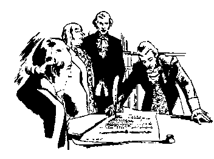

 <head> <title>First Amendment</title> <meta content="IE=9" http-equiv="X-UA-Compatible"></meta> <link href="css/page_style.css" rel="stylesheet" type="text/css"></link> </head><body>
  What does the First Amendment mean?
-----------------------------------

The First Amendment to the Constitution of the United States of America reads: Congress shall make no law respecting an establishment of religion, or prohibiting the free exercise thereof; or abridging the freedom of speech, or of the press; or the right of the people peaceably to assemble, and to petition the Government for a redress of grievances.

 Those who fled religious persecution in England introduced and supported this amendment. Among them were Congregationalists, Baptists (John Leland), Quakers, Roman Catholics, atheists and agnostics, any group the Church of England persecuted. However, in many colonies these people still suffered from religious persecution.
 The amendment only mentions Congress. However, U.S. courts extended its application to federal, state, and local governments in recent years. The amendment contains two basic parts. The "establishment clause" prohibits establishing a state church or religion, supported by taxpayers. The second part prohibits restricting citizens' free exercise of their convictions, through speech, writing, assembling, and petitioning government.

The wording "separation of church and state" is not in the first amendment. If one uses the phrase to prohibit government from using taxes (generated by congressional legislation) to support a religion, then that's proper application of this amendment. However, to prohibit any religious expression in anything governmental violates the second part of the first amendment. In fact, the Declaration of Independence and the Constitution itself contain the words "their Creator," "the Supreme Judge of the world," and "the Year of our Lord." One of the main premises in Dr. Martin Luther King's "I Have A Dream" speech is the following clause from the Declaration of Independence: We hold these truths to be self-evident, that all men are created equal, that they are endowed by their Creator with certain unalienable Rights, that among these are Life, Liberty and the pursuit of Happiness.

 
Our public schools are confused and fight over the application of the First Amendment. Because teachers' salaries come from taxes, teachers' can't express their religious views to the exclusion of others. However, forbidding all religious expression with students violates the First Amendment. Besides violating freedom of expression, silencing all religious expression essentially establishes atheism/agnosticism as the government-supported religion. The same is true if teachers can express atheism/agnosticism, but not express differing religious beliefs.

The purpose of the establishment clause is to prevent government from forcing citizens to violate their religious convictions or to support a religion they oppose. This clause does not protect from people who offend through expressing their religious views. Public schools should teach students to respect people they disagree with and voice their disagreement in a civil manner.

 The First Amendment gives people the legal right to disagree with the government both through speaking and writing, even to the point of the petition process. It does NOT give the right to protest with violence against the government. This amendment eliminates the need for violent rebellion and allows peaceful means to rectify grievances.

 
©2001 Perry Vernon Webb. You may quote this page in part or the whole as long as you
 1) do not alter the wording and
 2) reference this Internet page as the source of the quote.
 
- [Back to home page.](index.md)
- [Back to "Where I stand".](stance.md)
- [How to receive a new life in Christ.](gospel.md)

Email: [pvwebb1@hotmail.com](mailto:pvwebb1@hotmail.com)

