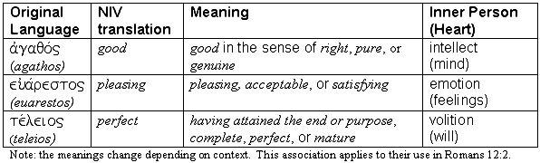

 <head> <title>(PVW) Romans 12:1-2: "test and approve what God's will is"</title> <meta content="IE=9" http-equiv="X-UA-Compatible"></meta> <link href="css/page_style.css" rel="stylesheet" type="text/css"></link> </head><body>
 Romans 12:1-2: "test and approve what God's will is"
----------------------------------------------------

Therefore, I urge you, brothers, in view of God's mercy, to offer your bodies as living sacrifices, holy and pleasing to God—this is your spiritual act of worship. Do not conform any longer to the pattern of this world, but be transformed by the renewing of your mind. Then you will be able to test and approve what God's will is—his good, pleasing and perfect will. (Romans 12:1-2, NIV)

Does making the right choices and actions define God's will for our lives? His good, pleasing, and perfect will encompasses the intellect, emotion, and will (volition). *Agathos*, translated *good,* means *good* in the sense of *right*, *pure*, or *genuine*. If someone described food as *agathos*, it would convey the idea that the food is *genuine*, *unadulterated*, or *edible*. *Kalos*, which means *good* or *beautiful,* describes food as tasting good. *Pleasing* translates *euarestos*. What *agathos* is to the intellect, *euarestos* is to the emotion. It means *pleasing,* *acceptable*, or *satisfying*. Perfect translates the word *teleios*, which means *having attained the end or purpose*, *complete*, *perfect*, or *mature*. Thus, it addresses the will, which plans and seeks to accomplish.  
 
God's will for our lives involves everything we are. Jesus told the woman at the well that the time was coming when true worshipers would no longer worship God in a physical location for sacrifices, but they would worship God in spirit and truth (John 4:23-24). The word the New International Version (NIV) translates as *spiritual* in Romans 12:1 is *logikos*. Some translations use *rational* or *reasonable*. Perhaps translating it as *mental* would convey the aspect of internalized worship without confusing this word with *pneumatikos*, (*spiritual*). God desires for our lives to completely belong to Him. Christ's sacrificial death abolished the old form of sacrifice (Hebrews 10:1-18) and fulfilled what those sacrifices symbolized. That sacrifice purchased our lives. Now our act of worship is to live out our lives as God's possession.

God's will includes everything we are and do externally, but more important it comprises everything that we are internally. God's will is foreign to the interests of the secular world. It also conflicts with our unrestrained natural desires (Romans 8:7-8). It requires a change in our thinking, desires, attitudes, and opinions. It requires a change in who we are. The Bible gives us the cognitive information we need. When we receive Christ's sacrifice and give our lives to Him, we receive God's Spirit (Romans 8:9-11). His Spirit counters our former attitudes and desires (Galatians 5:16-26).

©2000 Perry Vernon Webb. You may quote this page in part or the whole as long as you do not alter the wording and reference this Internet page as the source of the quote.
 
- [Back to home page.](noframesindex.html)
- [Back to "Scriptural Impacts".](impacts.html)
- [How to receive a new life in Christ.](gospel.html)
 

Email: [pvwebb1@hotmail.com](mailto:pvwebb1@hotmail.com)

 