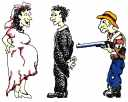
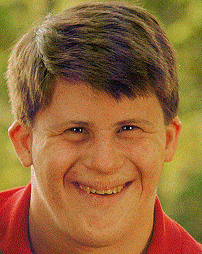

 <head> <title>(PVW) Discussion on abortion</title> <meta content="IE=9" http-equiv="X-UA-Compatible"></meta> <link href="css/page_style.css" rel="stylesheet" type="text/css"></link> </head><body>
 ABORTION
--------

Is ending the fetus' life to stop a pregnancy wrong? If so, is it serious enough to make it illegal? The arguments for legalized abortion claim making it illegal would take away a woman's freedom to choose what she does with her body. Arguments for outlawing abortion claim legalizing it gives someone the ability to take away another person's life without his/her choice. From the Christian and Jewish standpoint, the Bible does not directly address abortion. A safe means wasn't available during Biblical times. Some people use the same passage about accidentally causing a woman to miscarry ([Exodus 21:22-25](http://www.biblegateway.com/passage/?search=Exodus%2021:22-25)) to argue either for or against the unborn child's life having the same value as a person after birth.

 Usually a woman considers an abortion during an unplanned pregnancy. Those who perform abortions try to convince such women that an abortion is the best way to get their lives back to normal. In external appearance, aborting the fetus makes it look like the pregnancy never happened. However, an abortion has a profound emotional effect on a woman. Many try to explain this effect on the sudden change in hormones from ending a pregnancy. Similar to miscarriages, the hormonal effects are short-lived, adjusting back to their normal levels within a few months.

   ### Emotional Effects of Abortion

Psychologist [Dr. Anne Speckhard](http://www.amazon.com/s/ref=ntt_at_ep_srch?_encoding=UTF8&sort=relevancerank&search-alias=books&field-author=Anne%20Speckhard) in her book ([Psycho-Social Aspects of Stress Following Abortion](http://www.amazon.com/Psycho-Social-Aspects-Stress-Following-Abortion/dp/1556120591/ref=sr_1_2?s=books&ie=UTF8&qid=1311559757&sr=1-2), Kansas City, Missouri: Sheed and Ward, 1987) reports the results of a 1985 University of Minnesota study. The following lists the percentages of women affected by the listed Post Abortion Syndrome symptoms five to ten years after an abortion. <table class="p"> <tr style="font-family: sans; font-weight: bold;"><td style="color: #F00;">96%</td><td style="color: #080;">felt their abortion had taken a human life </td></tr> <tr style="font-family: sans; font-weight: bold;"><td style="color: #F00;">81%</td><td style="color: #080;">were preoccupied with the death of the unborn child </td></tr> <tr style="font-family: sans; font-weight: bold;"><td style="color: #F00;">81%</td><td style="color: #080;">experienced frequent crying </td></tr> <tr style="font-family: sans; font-weight: bold;"><td style="color: #F00;">77%</td><td style="color: #080;">experienced an inability to communicate </td></tr> <tr style="font-family: sans; font-weight: bold;"><td style="color: #F00;">73%</td><td style="color: #080;">had unwanted flashbacks of the abortion </td></tr> <tr style="font-family: sans; font-weight: bold;"><td style="color: #F00;">69%</td><td style="color: #080;">experienced feelings of "craziness" after the abortion </td></tr> <tr style="font-family: sans; font-weight: bold;"><td style="color: #F00;">69%</td><td style="color: #080;">were sexually inhibited </td></tr> <tr style="font-family: sans; font-weight: bold;"><td style="color: #F00;">65%</td><td style="color: #080;">had thoughts of suicide </td></tr> <tr style="font-family: sans; font-weight: bold;"><td style="color: #F00;">61%</td><td style="color: #080;">increased their use of alcohol </td></tr> <tr style="font-family: sans; font-weight: bold;"><td style="color: #F00;">54%</td><td style="color: #080;">had nightmares related to the abortion </td></tr> <tr style="font-family: sans; font-weight: bold;"><td style="color: #F00;">35%</td><td style="color: #080;">had perceived visitations with their child </td></tr> <tr style="font-family: sans; font-weight: bold;"><td style="color: #F00;">23%</td><td style="color: #080;">had uncontrollable hallucinations related to the abortion</td></tr> </table>

### Abortion Affects Others Besides Mother

The researchers also observed these Post Abortion Syndrome symptoms in others who participate in the abortion, such as parents, siblings, [other relatives](http://web.archive.org/web/20050407220730/http://www.boundless.org/1999/features/a0000076.html) of the child, and abortion clinic staff. These emotions become too much for most nurses in abortion clinics. They don't last there very long. Norma McCorvey, alias Roe, in Roe v. Wade, never had an abortion. Yet, she also suffered from the guilt of her role in legalizing abortions. [In 1995 she renounced her involvement in Roe v. Wade and announced her conversion to Christianity](http://www.roenomore.org/). She now has a ministry to help prevent abortions. How do you explain such feelings in people who have neither hormones nor religious convictions to cause them?
 [
 alias Jane Roe, in Roe v. Wade](http://www.roenomore.org/)

Political correctness calls the unborn child a fetus. However, the Latin term, *fetus,* more commonly refers to a baby just after birth. It is like calling a girl a female and a boy a male. It doesn't deny their gender but denies their humanity. Similarly, fetus doesn't deny the baby is alive. It denies the baby's humanity. That is exactly how one can explain the survey result taken by the *LA Times*. Even more striking, while 57% of respondents say they consider abortion to be murder, more than half of that group agree that a woman should have the right to choose an abortion. ([Alissa J. Rubin, "Americans Narrowing Support for Abortion ," *LA Times*, Sunday, June 18, 2000](http://articles.latimes.com/2000/jun/18/news/mn-42249))

 In other words, the living fetus doesn't have the same rights as a human being to be protected from murder. Many children born after being carried for only five months (point of 50% survival rate) still live today. Yet, people still abort fetuses after this age. 
### Pre-Birth Activity

In the seventies, it was popular for neurologists to claim that a baby had no mind before birth, as if someone flipped on a switch at birth. Now that people have actually investigated the influence of experience before birth, it is clear that children are already starting to learn language in the womb from their mothers' voices. Delivery room nurses can testify that the newborn already has a considerable background of experience at birth.

Since the late 1960's, we have had images of the fetus in the uterus. More recently, we have images from [fetal surgery to correct spina bifida](http://www.wnd.com/?pageId=4420), a condition caused when the spinal column doesn't close properly during fetal development.

 A startling image from such surgery is [Dr. Joseph P. Bruner's finger holding Samuel Armas's hand as he returned to his mother's womb](http://www.wnd.com/?pageId=4420). Samuel was born later without any sign of hydrocephalus, caused when the spinal column doesn't close properly on the brain end.

### Pre-Birth Death

Partial birth abortion is a practice of coldhearted legalism. The baby is perfectly capable of surviving. Yet, in the seconds before birth the doctor ends life. Can we say that the baby feels any less pain and is any less aware seconds before birth,than just after birth?

The logical extension of allowing partial birth abortion is to allow parents to exterminate children already born when they consider them defective or do not want them. Bioethicist [Peter Singer at Princeton](http://web.archive.org/web/20040602162813/http://www.dailyprincetonian.com/Content/1999/02/20/news/choudhury.html) already takes this position. Human babies are not born self-aware, or capable of grasping that they exist over time. They are not persons. Hence their lives would seem to be no more worthy of protection than the life of a fetus. —Rethinking Life and Death (Peter Singer)

[
 handicapped protesting Singer](http://web.archive.org/web/20010408191719/http://www.academia.org/singerquotes.html)

[
 Boundless Webzine article by Anne Morse](http://www.boundless.org/2000/features/a0000185.html)

 Our society tends to listen to those who holler the loudest or make the largest campaign contributions. The unborn baby can do neither. But, now people who survived abortions have reached voting age and are speaking out. One such individual is [Gianna Jessen](http://web.archive.org/web/20000610205208/http://www.nd.edu/~prolife/Jessen.html). Although she has cerebral palsy because of the botched abortion, she enjoys life. Look the people in the face who survived a botched abortion and tell them they should have never been born. Tell them they don't deserve to live. Do the same to the person with Down's syndrome, the one who's blind, who can't hear, or who's born paralyzed that their parents should have aborted them rather than let them live.

[
Gianna Jessen](http://www.giannajessen.com/)
survived abortion
as a fetus

[
Stephen Hawking](http://www.pbs.org/wnet/hawking/cosmostar/html/hawking.html)
renowned paraplegic
physicist

Jason Andrew Kingsley

Mitchell Levitz
Advocacy Coordinator/Editor - CUI

 
### Impact of Legalization on Women

Interestingly, a younger woman from the group most affected by legalizing abortion is more likely to support unborn children's right to live than her older counterpart. Some of the most politically supportive of the right to life are women who had an abortion thinking it was the right thing to do. However, despite their moral opinion, the experience left them with deep feelings of guilt. It is common for young girls to dream of having a family with children. A woman cannot just turn off these feelings and say this time doesn't matter. Women who lose a baby from a miscarriage usually feel the grief as if losing a child already born. Women who abort a baby often feel the guilt as if they had killed a newborn baby. We need to answer why do women have these feelings?

 Although my wife has never had to face the decision of an abortion, I have noticed a subjective difference in her attitude toward both human and animal life after the birth of our children. Talking about a person dying prematurely, whether from a car accident or murder, affects her emotionally. She can only think of the sacrifice that mother made to bring that life into the world. The only difference between my wife and me as far as having children is that she bore them. She said that carrying a moving and kicking child within herself had a lasting emotional effect.

### Who's Making the Choice?

What motivates the woman who had an abortion to become politically active supporting the rights of the unborn child? Some may see it as guilt. It's the same motivation as Mothers Against Drunk Driving. Their child has died, but they still have the chance to stop future deaths of other children.

A woman after an abortion may work so devoutly for the rights of the unborn because she feels victimized. She was given no more alternatives than the person going to a sales person who wants to sell the product and doesn't want no for an answer. There was no mention about how she would feel after an abortion or any counseling about the life inside of her.

If a minor goes to the doctor with an injury, the doctor quizzes the child about how the injury occurred in an attempt to see if child abuse occurred. This is not the case with an abortion. In fact, in some states minors can have an abortion without the knowledge of her parents. This can allow the perpetrator of child abuse to conceal his crime.

### Choose Hope Rather than Despair

I'm not a person who protests at abortion clinics and definitely sees no justification for violence, especially killing, while protesting for the right to life. A protest with an impact would be to tell an abortion clinic, "If you let us protest in front of your clinic, we will stand as a human shield between you and anyone who tries to use a weapon on people in your clinic." My personality is not the kind that likes to be obnoxious, but I've seen anti-drug advertisements showing the misery of an infant born to a drug-addicted mother. Some of the right-to-life protestors have used similar tactics. To say the tactic is legitimate when you agree with its message, but should be illegal when you don't, is discriminatory.

To the person who is struggling with guilt, whether from an abortion or some other reason, I have good news. [Jesus Christ came to earth and died so that you could be forgiven and have a new life in Him. ](gospel.html)Many unborn children did not die in vain. Many women who did not know this new life in Christ and who previously felt that an abortion was a legitimate alternative, after the guilt of the experience have now come to Christ.

To the person who is either facing an unwanted pregnancy or struggling with the guilt of an abortion, the following link to [Crisis Pregnancy Centers Online](http://www.optionline.org/) lists local locations that offer help.

 [p r e g n a n c y c e n t e r s e a r c h](http://www.optionline.org/)
Note: I have given the moral reasons that I support protecting the right of the unborn child instead of the right of a woman to choose an abortion. There are also personal health reasons for a woman not to choose an abortion such as the possible loss of fertility or an increased chance of breast cancer.

©2000 Perry Vernon Webb. You may quote this page in part or the whole as long as you
 1) do not alter the wording and
 2) reference this Internet page as the source of the quote.
  
- [Previous edition of this page.](abortion.html)
- [Back to home page.](index.html)
- [Back to "Where I stand".](stance.html)
- [How to receive a new life in Christ.](gospel.html)

Email: [pvwebb1@hotmail.com](mailto:pvwebb1@hotmail.com)

