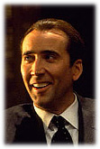

 <head> <title>(PVW) A Modern Rendering of A Christmas Carol</title> <meta content="IE=9" http-equiv="X-UA-Compatible"></meta> <link href="css/page_style.css" rel="stylesheet" type="text/css"></link> </head><body>
 A Modern Rendering of *A Christmas Carol*
-----------------------------------------

 <table border="0" cellpadding="4" cellspacing="0" width="377"> <col width="69"></col><col width="187"></col><col width="97"></col> <tr valign="TOP"><td width="69"></td> <td width="187"></td> <td width="97"></td></tr> </table>

Do you understand the message Charles Dickens conveyed in A Christmas Carol? Most people familiar with Charles Dickens remember how his writings brought social reform, in particular enactment of child labor laws. Charles Dickens wrote *A Christmas Carol* as a Christmas message to a Christian society. Christian societies, composed of human beings, always fall short of the ideal. What interferes with understanding *A Christmas Carol*? While Ebenezer Scrooge would fit in as a businessman in 1843, social reform and concern for corporate image today make a character as Scrooge uncommon today. It's too easy to see Scrooge as an artifact of past society rather than identify with him today. But, Charles Dickens did intend for his readers to identify with Scrooge. He wrote in the Preface: I have endeavoured in this Ghostly little book, to raise the Ghost of an Idea, which shall not put my readers out of humour with themselves, with each other, with the season, or with me. May it haunt their houses pleasantly, and no one wish to lay it.

In *A Christmas Carol* Mr. Dickens wasn't directly addressing social issues. The problem he addressed was the state of Ebenezer Scrooge's heart. His solution in the end was a changed Scrooge. Charles Dickens did emphasize the social implications of the Gospel, such as the statement of Marley's Ghost: "At this time of the rolling year," the spectre said, "I suffer most. Why did I walk through crowds of fellow-beings with my eyes turned down, and never raise them to that blessed Star which led the Wise Men to a poor abode? Were there no poor homes to which its light would have conducted me!"

 However, Mr. Dickens emphasized relationships with people throughout the story. Scrooge had scarcely thought of Jacob Marley, his business partner, for the seven years after his death. Important are Scrooge's missed opportunities at marriage and with his living relatives. Also, how he treated his employees, tenants, and others around him. Scrooge found happiness in his family, friendship, and helping others.

How would you rewrite *A Christmas Carol* to fit the present? A movie conveying a similar message is [*Family Man*](http://www.family-man.com/). It's format is very different. More like the movie, [*It's a Wonderful Life*](http://www.ozcraft.com/scifidu/wndrlife.html), with only an altered present rather than a past, present, and future. And, with an angel rather than ghosts. But, the main character, Jack Campbell, is more like Ebenezer Scrooge than George Bailey. Both *Family Man* and *A Christmas Carol* have a happy ending offset with the sadness of missed opportunity.

 The *Family Man* is far from perfect. The only identification with Christianity is it happens on Christmas. God is only implied. Appearing as a thief and using deception, Cash, the angel-like character, is a poor representation of God's character. A story with a strong orthodox Christian emphasis might include such things as what a child would have been if not aborted. However, as the movie stands, it doesn't alienate those who need its message. It does have strong support for fidelity in marriage in Jack Campbell's conversations with his friend Arnie. One might have a better story specifically addressed to Christians, but *Family Man* addressing the average person in the U.S well. Not only does it say something to people neglecting marriage for corporate status and gain, but it assures the person who puts family above carrier.

Before his death, one of the world&#146;s richest men said that he would have given all his wealth to make one of his six marriages succeed. It&#146;s one thing to make a living, but quite something else to make a life. (Wiersbe, W. W. (1995). *Be skillful*. Wheaton: Victor Books.)

©2001 Perry Vernon Webb. You may quote this page in part or the whole as long as you
 1) do not alter the wording and
 2) reference this Internet page as the source of the quote.
 
- [Back to home page.](index.html)
- [Back to "Where I stand".](stance.html)
- [How to receive a new life in Christ.](gospel.html)

Email: [pvwebb1@hotmail.com](mailto:pvwebb1@hotmail.com)

