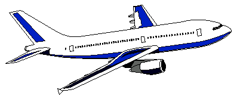

 <head> <title>(PVW) What Defines a Real Hero?</title> <meta content="IE=9" http-equiv="X-UA-Compatible"></meta> <link href="css/page_style.css" rel="stylesheet" type="text/css"></link> </head><body>
What Defines a Real Hero?
-------------------------

Today society looks to people who make themselves the best in what they do as heroes, especially if they overcome great odds to do so. However, nothing in such achievement assures good character. A extremely selfish person can achieve such a feat. Who really deserves out respect?

 
When terrorists flew two passenger planes into the World Trade Center in New York and one into the Pentagon, one plan crashed in rural Pennsylvania. Relatives of a passenger on the plane that crashed in rural Pennsylvania said he related during a phone call that men on board voted to try to overpower the three hijackers. Shortly after that call, the plane went down, as it appeared headed for Washington.
{"NATO backs retaliation for attacks on United States," September 12, 2001 Posted: 5:07 p.m. EDT (2107 GMT), http://www.cnn.com/2001/US/09/12/america.under.attack/index.html}

Surely the passengers knew they had virtually no chance of landing the plane when they overcame the hijackers. But, in phone conversations with relatives on the ground, by that time they knew the hijackers' intent to use the plane as a missile of mass destruction. The best they could do was to ditch the plane in an uninhabited area. In their last moments, they made their lives count by saving the lives of those at the target. What gives me more assurance than any security measures or any retaliation is the courage of these passengers to stand up for right in the face of death. Hundreds of firefighters and police died trying to rescue people when the first tower of the World Trade Center collapsed. Rescue workers worked past the time of exhaustion to rescue people trapped, but still alive.

Military pilots have died guiding their aircraft away from populated areas rather than bailing out with the possibility the plane might kill someone. Yet, you won't hear people challenge each other over remembering their names. The pay of some military personnel is so low some qualify for food stamps. The pay of firefighters and police is not usually something to leave us envious. Yet, some people in sports and entertainment have exorbitant salaries. People use their names in games of trivia. Why?

Jesus said this us about greatness. You know that the rulers of the Gentiles lord it over them, and their high officials exercise authority over them. Not so with you. Instead, whoever wants to become great among you must be your servant, and whoever wants to be first must be your slave&#151; just as the Son of Man did not come to be served, but to serve, and to give his life as a ransom for many. (Matthew 20:25-28, NIV)

Greater love has no one than this, that he lay down his life for his friends. (John 15:13, NIV)

 The real heroes are those who set aside their own interests to rescue other people. The ultimate hero is one who gives his/her life to save another's life. 

©2001 Perry Vernon Webb. You may quote this page in part or the whole as long as you
 1) do not alter the wording and
 2) reference this Internet page as the source of the quote.
 
- [Back to home page.](index.md)
- [Back to "Where I stand".](stance.md)
- [How to receive a new life in Christ.](gospel.md)

Email: [pvwebb1@hotmail.com](mailto:pvwebb1@hotmail.com)

