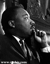

 <head> <title>HOMOSEXUALITY</title> <meta content="IE=9" http-equiv="X-UA-Compatible"></meta> <link href="css/page_style.css" rel="stylesheet" type="text/css"></link> </head><body>
 HOMOSEXUALITY
-------------

The political struggle makes discussing homosexuality so emotional many will not allow rational debate. People would rather categorize others and put words in their mouths rather than letting them express their views. Thus, I'm bringing this up at the beginning to dispense with preconceived ideas. I have a first cousin, a third cousin, and a fourth cousin who are practicing homosexuals. While I don't agree with their lifestyle, I still love them as any of my cousins. The two oldest have lived with the same partners for more than fifteen years. We still welcome them with their partners to our family reunions and give them a hug like the rest of the family.

### Do Homosexuals Need Protection as a Minority?

This involves a series of questions. Finding which one to ask first is difficult. A society would be unjust to deprive someone of the ability to make a living. If scientific fact proved homosexuality were a purely genetic trait such as skin color, then homosexuals would be a legitimate minority. (A fuller discussion of this topic comes later). On the other hand, when we grant equal rights protection based on behavior, equal opportunity moves into another area.

If homosexuals received less pay, there might be some basis for needing minority protection. However, the average pay and position of homosexuals are better than the average population.

 

The affluence of homosexuals gives them extensive power in politics and the news media. They have well funded and organized lobbyist groups, such as the Gay and Lesbian Alliance Against Defamation (GLAAD). National Lesbian and Gay Journalists Association (NLGJA) also represents them in the news media: One of the most effective pressure groups in this brave new media world is the [National Lesbian and Gay Journalists Association.](http://www.nlgja.org/)... The NLGJA's president works at the Dallas Morning News. One vice president works at CNN. Another works at Newsday. The treasurer works at the New York Times. The secretary works for USA Today. (Joseph Farah, ["Activists in the newsroom"](http://www.wnd.com/index.php?pageId=1652))

In a 1995 Times Mirror pole, 41% of the public found homosexuality acceptable as opposed to 83% of the national press corps. The newest edition of the Associated Press Stylebook now includes the statement, "Avoid references to gay, homosexual or alternative 'lifestyle.' " The reference to "lifestyle" implies chosen behavior.

In every state (Hawaii, California, and cities in Vermont) presenting the issue to the general public, popular vote defined marriage as between one man and one woman. This reveals homosexuals don't have support from the general population even in liberal states. However, they do have the money to lobby congress, sway the media, and advertise to change public opinion.

With respect to giving equal rights protection to an affluent minority, some parts of the Southwest United States actually have a majority Hispanic population. Yet, from the standpoint of minority protection, we cannot call the smaller Caucasian population a minority because that population has higher salaries and more managerial positions than the majority Hispanic population. Similarly, we consider women a minority from the legal standpoint even though women are not a minority in numbers. Women average lower pay than men, and the situation didn't improve until receiving such status. Thus, although homosexuals are a minority in numbers, why should a group with more money and influence than the average citizen receive minority protection?

 The homosexual's political movement is in stark contrast to the civil rights movement. Especially at the beginning of the movement, blacks had much lower income and fewer managerial positions than average. Dr. Martin Luther King, Jr. appealed to the ideals of our country, as quoted in his "[I have a Dream](http://mlk-kpp01.stanford.edu/index.php/encyclopedia/documentsentry/doc_august_28_1963_i_have_a_dream/)" speech, "We hold these truths to be self-evident: that all men are created equal." In no way can we compare the movement for homosexual rights to the struggle of blacks for civil rights, nor should homosexuals receive the same protection.
### Should We Outlaw Ridicule?

One argument homosexuals have for minority protection is protection from ridicule. But, government is on very dangerous ground outlawing ridicule, especially when those who want such protection want the freedom to ridicule their opposition. People shouldn't ridicule other people for any reason. Tolerance is respecting the person one disagrees with as a fellow human being. Tolerance is not forcing everyone to have the same opinion about homosexuality. That is forcing approval rather than tolerance.

While publicizing cases of violent crimes is the political tactic to gain support for hate crimes legislation, most hate crimes reported by homosexuals to the FBI were ridicule. On the other hand, we should protect everyone from violence. If we need to increase the penalty for such violence, it is because the penalty is too lax. We need to increase penalties to protect everyone, not just a select few. Similarly whatever protection the government gives for ridicule, that protection needs to extend to everyone, including people who consider homosexuality a sin. Children need to learn how to treat people courteously even if they disagree. Teaching them to respect homosexuals while belittling those who believe homosexuality is a sin is not how to do this.

### Genetic Trait or Chosen Behavior

If homosexuality were a genetic characteristic such as skin, hair, or eye color, blaming someone for homosexual behavior would be cruel. Many have tried to argue that homosexuality has this same kind of genetic dependence. The evidence has not convinced those on either side of the argument. A site called "[Religious Tolerance](http://www.religioustolerance.org/hom_caus.htm)" argues for sexual orientation being genetically determined. The National Association for Research and Therapy of Homosexuality, ([NARTH](http://www.narth.com/menus/born.html)) argues that, while certain genetic traits might increase the likelihood of choosing homosexuality, the final decision is up to the individual.

 

 The problem with using physical characteristics of the brain to argue for a genetic dependence is we cannot compare the brain with a computer, in which the physical circuitry and hardware is separate from the software. The brain is not electronic but electrochemical. We know, especially with children, the brain needs stimulus from the senses to wire itself. Thoughts, decisions, and experience change the physical characteristics of the brain because its circuitry, hardware, and software are an integral part of each other.

 People study genetic dependence by looking at adopted identical twins that grew up in different homes. Some studies show that about 50% of the identical twins of homosexuals are homosexual. Other studies show no higher percentages in twins of homosexuals than the percentage of homosexuality in the general population. Any correlation less than 100% is less than the correlation between identical twins with skin, hair, or eye color. Most agree that genetics influences homosexuality, but also agree that other factors are also involved.

 
When considering the question of whether a homosexual chooses his/her behavior, we need to consider the presuppositions some psychologists will make. Some believe genetics and environment predetermine all behaviors. Thus, they will obviously conclude that homosexuals do not choose their lifestyle.

 To consider genetic influence on chosen behavior, consider professional basketball players. Many of us wouldn't have much of a choice about being a professional basketball player. If our height isn't above average, we aren't tall enough. We may lack other abilities that might give us the desire to pursue such a career. Yet, if we believe that people have the ability to choose, we will agree that a professional basketball player is one because he/she chooses to be one. At the same time, we wouldn't expect the identical twin of a professional basketball player to always also be one. We would expect the percentage of identical twins that were also professional basketball players to be much higher than that of the general population. However, it is much easier for a basketball player to leave basketball than a homosexual to leave homosexuality.

Another factor demonstrating that homosexual is not purely dependent on genetics is any genetic trait that significantly influences reproduction tends to die out within a few generations. Homosexuality greatly reduces reproduction. Homosexuals will sometimes have heterosexual relationships or artificial insemination to have children. However, they average only twenty percent as many children as heterosexuals. A purely genetic trait that reduces reproduction by eighty percent would die out very rapidly.

Is Sexual Orientation Determined Before Birth?
----------------------------------------------

Keith Kendrick, a neuroscientist at the Babraham Institute in Cambridge, England, conducted a study strongly suggesting an environmental factor for sexual orientation. Dr. Kendrick noticed that men often married wives that looked much like their own mother. To test this influence he had goats raise newborn lambs and sheep raise newborn kids. Sheep and goats raised this way wanted to mate with the species of their adopted mother rather than their own.

[
 ABC News article, "Just Like Mom"](http://web.archive.org/web/20040818153823/http://more.abcnews.go.com/onair/closerlook/wnt_000211_cl_loveexperiment_feature.html)

What if an alcoholic had been drinking since two years old because his/her parents gave him/her an abundance of alcoholic beverages at that age. We would tend to say that such an alcoholic did not choose to drink and could not keep from engaging in this behavior. However, alcoholics have successfully quit drinking through their own desire and choice to seek help. Thus, even if an alcoholic had little choice getting into his/her situation, he/she can still choose to stop drinking.

 Thus, an even more important question related the responsibility of a homosexual for his/her behavior is can he/she change?
### Can a Homosexual Chose to Change His/Her Behavior and Become Heterosexual?

[
Exodus
International](http://exodusinternational.org/)

[
John Paulk's Family
"How One Man Overcame
Homosexuality"](http://web.archive.org/web/20000815100446/http://www.family.org/cforum/research/papers/A0002272.html)

[
Seminar](http://exodusinternational.org/love-won-out/)

What is interesting about this question is [some ex-homosexuals claim they did exactly this](http://www.messiah.edu/hpages/facstaff/chase/h/testimon/index.htm). Many work in ministries to help others who want to escape the same situation. Yet, many homosexual activists deny this group can really exist. They claim that either these people weren't really homosexuals or they will be unhappy until they return to homosexuality.
But whether either side likes it or not, ex-gays are here, in numbers too large to deny. Thousands of them have been involved with ex-gay groups, and doubtless many more have never contacted any group, keeping their entire experience (both entering homosexuality and leaving it) quiet. It's simply not credible to dismiss so many people as being engaged in a gigantic, collective fraud. Only an ideologue would try. (Matt Kaufman, "[ When Fred Phelps Sounds Like a Gay Activist](http://www.boundless.org/2000/regulars/kaufman/a0000186.html)")

[
 A Journey from Bitterness and Sexual Confusion](http://www.boundless.org/2005/articles/a0000041.cfm)
 *by Amy Tracy*

The well-known psychiatric researcher, Dr. Robert Spitzer, M.D., at Columbia University had planned to [moderate a debate at the May 17, 2000 meeting of the American Psychiatric Association](http://www.massnews.com/past_issues/2000/3_March/300srt.htm) on whether therapy can help homosexuals in changing their orientation. This same [Dr. Spitzer drafted the 1973 APA justification for declassifying homosexuality as a mental disorder](http://web.archive.org/web/20001017152604/http://family.org/docstudy/newsletters/A0012066.html) However, Dr. Spitzer's statement about interviewing some people who had left homosexuality was the following:
["I'm convinced from people I have interviewed, that for many of them they have made substantial changes toward becoming heterosexual. I think that's news." And he added, "I now claim that these changes can be sustained."](http://www.massnews.com/past_issues/2000/3_March/300srt.htm)

 The American Psychiatric Association canceled the debate [because the psychiatrists scheduled to oppose the "reorientation therapy is effective and ethical" position refused to participate](http://www.leaderu.com/orgs/narth/debate.html). The reason they pulled out was because they did not even want to give reorientation therapy the credibility that it was worthy of debate. Consequently, people who left homosexuality picketed the conference, including 40 leaders from Exodus International.

[
 Anthony Falzarano speaks
to a conference participant
as protesters carry signs
 saying, "How Dare You Tell
Us We Can't Change!"](http://www.narth.com/docs/picket.html)

[
 More demonstrators outside
the A.P.A. convention
hotel. Sign: "Maybe The
 APA Can't Heal A
Homosexual But God Can!"](http://www.narth.com/docs/picket.html)

[
Sign: "APA - How Do You
Explain 20,000 Former
Homosexuals!"](http://www.narth.com/docs/picket.html)

[
Sign: "I Used To Be
Gay...And Now I Am
Happy!"](http://www.narth.com/docs/picket.html)

When [Yvette (Cantu) Schneider gave her testimony about leaving homosexuality to a Christian group at Dartmouth University](http://www.frc.org/culture/cu00e4.html#title3), homosexual protestors interfered so that police had to escort her away for her own protection.

 There are very few people about whom you could say: their very existence threatens a movement.
 from [No Longer Lesbian:
 An Interview with Yvette Cantu](http://web.archive.org/web/20041010105122/http://www.americansfortruth.org/ycc_interview.html)

The intolerance of homosexual activists [toward this group of ex-homosexuals ](http://web.archive.org/web/20000819042726/http://www.family.org/cforum/fnif/news/A0012515.html)is unfounded. They have even claimed that the actions of such people promotes violence against homosexuals. Considering the extreme reaction of homosexual activists to [Dr. Laura Schlessinger's](http://web.archive.org/web/20030820163440/http://www.mcjonline.com/news/00/20000314b.htm) comments that homosexuality is a deviant behavior, one wonders about the true meaning of homophobia. Does it really mean someone who has an irrational fear about homosexuality or does homophobia really mean someone who homosexual activists have an irrational fear toward?

### Are Employers Justified to Discriminate against Homosexuals in Some Types of Jobs?

Some cases where jobs need to discriminate are not allowing a blind person to be a bus driver or not allowing someone who still stutters to anchor the news on television. Are there jobs where a homosexual is not fit for the job? The only way someone could claim no exceptions is to deny the genetic evidence and claim that homosexuality as just as solidly dependent on genetics as race.

What about religious groups that believe homosexuality is immoral? Requiring those religious groups to hire homosexuals for religious leaders and teachers is a severe violation of the freedom of religious expression in the First Amendment to the Constitution of the United States of America.

However, the jobs where a dispute is more likely is public school teachers. If we recognize other factors from genetics as important in determining homosexuality, then what children learn most likely plays a part in whether they develop homosexual behavior. What parent would risk their children learning improper behavior to save a teacher's job?

This question is much larger than homosexuality. It is a matter of whether we can hold a teacher accountable for moral behavior. Supreme Court decisions make it almost impossible for a public school to do so. On the other hand, what about when a teacher flaunts such behavior in class and undermines the moral teachings the parents taught the students? How is this different than a teacher teaching religious beliefs that conflict with the students' beliefs? Moral behavior is fundamental to religious education. Thus, private religious schools should have the right to require moral behavior of teachers.

What is interesting is that homosexuals don't want to be fired for being homosexual, but [a newspaper, The Raleigh News and Observer, doesn't see any problem with firing an employee because he left the homosexual lifestyle](http://web.archive.org/web/20050926050847/http://headlines.agapepress.org/archive/8/232000c.asp).

### Should Churches or Government Recognize and Perform Same-Sex Marriages?

For the sake of free choice one might to allow people to behave in a way one disapproves. However, when it comes to performing same-sex unions, whoever allows such unions approves this behavior. The only basis a church might have for dismissing the scriptural basis for homosexuality being immoral would be if genes solely determined homosexuality. When it comes to government, should governments show their approval of such unions when popular votes show the overwhelming majority disapproving them?

The most important item at stake in same-sex unions is should government allow people in such unions to adopt children? One might question the influence of teachers on children, but the influence of parents on children is profound. [GLAAD](http://www.glaad.org/) is one of the major supporters of homosexual adoption. Even if GLAAD's claim were true that homosexual unions were to raise the same percentage of heterosexual children as the general population, consider what GLAAD supports. They oppose censoring pornography, even from minors. They oppose sex education that teaches abstinence until marriage.

Can we ignore the influence on adults on children when such groups as [North American Man-Boy Love Association (NAMBLA)](http://www.thecpac.com/about-amazon.html) exists? NAMBLA's states their goal as "to end the oppression of men and boys who have mutually consensual [sexual] relationships." Parents, for example, were mortified when New York City's WNBC-TV uncovered the existence of pedophiles within the public school system. According to an article by John Leo in U.S. News World Report, the City Board of Education had known about at least one pedophile - teacher Peter Melzer - since 1984, but did nothing about it.

 Melzer, as it turned out, is on the NAMBLA steering committee and the editorial board of the organization's periodical, the NAMBLA Bulletin. ([Ed Vitagliano, Homosexuality and Child Molestation: the Link, the Likelihood, the Lasting Effects: Some homosexuals want the next generation...in mind and body ](http://web.archive.org/web/20001018080735/http://www.afa.net/Homosexual_Agenda/ha080900.shtml))

 Granted, while most homosexuals might oppose this group, what happens when a NAMBLA member claims discrimination because he is not allowed to adopt as a homosexual.
### Conclusion

The homosexual activists' political arguments all hang on one assumption, that homosexuality is completely determined genetically. Even data biased in their favor does not support this. Homosexuals often blame society's standards against homosexuality for their guilt. People criticize someone trying to legislate morality, although one cannot legislate without legislating morality.
J. Budziszewski, *Written on the Heart: The Case for Natural Law*. Downera Grove, Illinois: Inter Varsity Press, 1997, p. 44.
 The worst legislation is legislating science by making opposing views illegal. People should use evidence, not legislation, to convince people about genetic traits. Some people don't want government to force moral views on them, but try having government control their ability to question and investigate.

On the other hand, homosexuals don't need what Fred Phelps has to offer: Quiz time: What do gay activists have in common with the followers of Fred Phelps, the Baptist minister who shows up at places like slain homosexual Matthew Shepard's funeral carrying signs that say "God Hates Fags" and "Fags Die, God Laughs"?

 Answer: They both insist that homosexuals can't possibly change — and they're both mad at anyone who says otherwise. At Focus on the Family, we know this first hand, because we've now had the distinction of being denounced by both groups. (Matt Kaufman, "[When Fred Phelps Sounds Like a Gay Activist](http://www.boundless.org/2000/regulars/kaufman/a0000186.html)")

 Fred Phelps' response to homosexuality does more to advance homosexual political causes than homosexuals do themselves. Mr. Phelps' behavior deviates tremendously from acceptable Christian as well as Baptist behavior. His abnormal behavior is [not limited to his actions toward homosexuals](http://web.archive.org/web/20010217045056/http://gaylesissues.about.com/newsissues/gaylesissues/library/content/bl_phelpsmain.htm). It's shameful some people saw Mr. Phelps's behavior on national TV and thought it was normal for Christians. Keep in mind that Dr. Martin Luther King, Jr. was also a Baptist minister. I'm also a Baptist.
Homosexuals can find the real solution to guilt in Christ. Christ loves sinners so much that He died for them, to take away their sins and give them a new life. The homosexual or the person dying of AIDS needs to know that God loves them and wants to save them.

[Previous edition of this page](homosexual.html) (approaches this subject from a Biblical perspective.)

 [A Letter to President George W. Bush](letter1.html)

 A Focus on the Family link that describes the impact legislation favoring homosexuality has had on other countries:
 [A Letter From Dr. Dobson -- The Christian Response to the Homosexual Agenda](http://web.archive.org/web/20000622094557/http://www.family.org/docstudy/newsletters/a0001935.html)

©2000 Perry Vernon Webb. You may quote this page in part or the whole as long as you
 1) do not alter the wording and
 2) reference this Internet page as the source of the quote.
 
- [Back to home page.](noframesindex.html)
- [Back to "Where I stand".](stance.html)
- [How to receive a new life in Christ.](gospel.html)

Email: [pvwebb1@hotmail.com](mailto:pvwebb1@hotmail.com)

