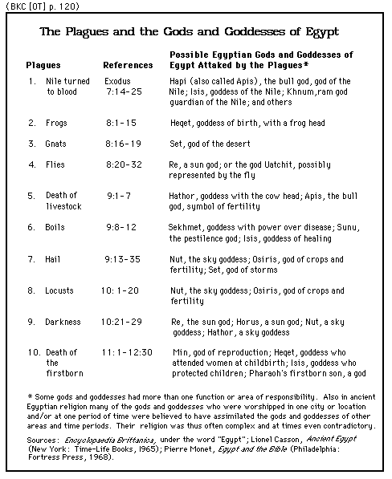

 <head> <title>(PVW) Exodus 3:11-15: "Who is the LORD?"</title> <meta content="IE=9" http-equiv="X-UA-Compatible"></meta> <link href="css/page_style.css" rel="stylesheet" type="text/css"></link> </head><body> 
 Exodus 3:11-15: "Who is the LORD?"
----------------------------------

But Moses said to God, "Who am I, that I should go to Pharaoh and bring the Israelites out of Egypt?"

And God said, "I will be with you. And this will be the sign to you that it is I who have sent you: When you have brought the people out of Egypt, you will worship God on this mountain."

Moses said to God, "Suppose I go to the Israelites and say to them, 'The God of your fathers has sent me to you,' and they ask me, 'What is his name?' Then what shall I tell them?"

God said to Moses, "I AM WHO I AM. This is what you are to say to the Israelites: 'I AM has sent me to you.'"

God also said to Moses, "Say to the Israelites, 'The LORD, the God of your fathers—the God of Abraham, the God of Isaac and the God of Jacob—has sent me to you.' This is my name forever, the name by which I am to be remembered from generation to generation.

 Exodus 3:11-15, NIV

The concept of *knowing* is a central theme in the book of Exodus. The Hebrew word *yada`*, meaning *know*, occurs 45 times in Exodus. This word sometimes has the meaning *see*. Other times it has the idea of concern, reflecting the idea of personal acquaintance. In Genesis 4:1 this word has the meaning of *knowing intimately*. The verses that follow are some typical examples of *know* used in Exodus summarizing this theme. Then a new king, who did not know about Joseph, came to power in Egypt. (Exodus 1:8, NIV)

 Because Pharaoh didn't know Joseph, he didn't know the Lord. Pharaoh made the infamous statements. Pharaoh said, "Who is the LORD, that I should obey him and let Israel go? I do not know the LORD and I will not let Israel go." (Exodus 5:2, NIV)

 God answers Pharaoh's question with [ten signs or plagues that are an affront to the major deities of Egypt](#chart). God initiated these signs to make Himself known
(Exodus 7:1-5, 17-18; 8:10, 19, 22; 9:13-16; 10:1-2; 11:7)
.

With every sign, God asked Moses to do something
(Exodus 7:8-9, 17-18; 8:5-6, 16-17, 20; 9:1, 8; 9:22-23; 10:12-13, 21-22; 12:1-13)
 before the sign. God could have easily done the signs without Moses' action. However, an important aspect of these signs is God makes Himself know through faith. The best example of God giving Moses a sign that does not happen until after Moses obeyed in faith is the following: And God said, "I will be with you. And this will be the sign to you that it is I who have sent you: When you have brought the people out of Egypt, you will worship God on this mountain." (Exodus 3:12, NIV)

 We want to do things backwards. We want God to give us a sign before we act. It is only after we faithfully follow God and see His work in our lives that we see God working out His plan in our lives.

Here are more verses related to knowing: Then the LORD said to Moses, "Now you will see what I will do to Pharaoh: Because of my mighty hand he will let them go; because of my mighty hand he will drive them out of his country."

God also said to Moses, "I am the LORD. I appeared to Abraham, to Isaac and to Jacob as God Almighty, but by my name the LORD I did not make myself known to them. ...

I will take you as my own people, and I will be your God. Then you will know that I am the LORD your God, who brought you out from under the yoke of the Egyptians."

 Exodus 6:1-3,7, NIV

The following passages about knowing are after the plagues: "And I will harden Pharaoh's heart, and he will pursue them. But I will gain glory for myself through Pharaoh and all his army, and the Egyptians will know that I am the LORD." So the Israelites did this." (Exodus 14:4, NIV)

Moses also said, "You will know that it was the LORD when he gives you meat to eat in the evening and all the bread you want in the morning, because he has heard your grumbling against him. Who are we? You are not grumbling against us, but against the LORD." (Exodus 16:8, NIV)

When the Israelites saw it, they said to each other, "What is it?" \[*manna* in Hebrew\] For they did not know what it was. (Exodus 16:15, NIV)

Jethro was delighted to hear about all the good things the LORD had done for Israel in rescuing them from the hand of the Egyptians. He said, "Praise be to the LORD, who rescued you from the hand of the Egyptians and of Pharaoh, and who rescued the people from the hand of the Egyptians. Now I know that the LORD is greater than all other gods, for he did this to those who had treated Israel arrogantly." (Exodus 18:9-11, NIV)

 Also related to knowing God is where Moses asked to see God (Exodus 33:12-23). God showed His glory to Moses, but Moses could not see God's face. What Moses saw we do not understand. How can we see the infinite God? How can our finite minds understand the Infinite? We haven't seen God, but God came to us as a man, Jesus Christ
(John 1:18; 6:46)
. The best evidence that God is the personal God that highly values people is that His most complete revelation is His coming as a human being. When Philip asked to see the Father, Jesus' reply was that, when he had seen Jesus, he had seen the Father (John 14:5-11).

The message that we see God by seeing Jesus Christ is a main theme in the Gospel of John. As far as the New Testament words translated *know* in the Gospel of John, *ginosko* occurs 57 out of the 117 times in the Gospels and *oida* occurs 84 out of the 154 times in the Gospels. Roughly half the occurrences in all four gospels are in John. Another important passage related to knowing God is the following: "I am the good shepherd; I know my sheep and my sheep know me--just as the Father knows me and I know the Father--and I lay down my life for the sheep.... My sheep listen to my voice; I know them, and they follow me." (John 10:14-15,27, NIV)

When we look at God's general revelation in the universe, God is impossible for us to comprehend with our finite minds. Our incomplete scientific modeling to understand the universe gives us an inadequate picture of God. Because the model is cold and mechanical, scientists that disregard the Biblical revelation see God as cold and mechanical if they attempt to picture Him at all. Yet, quite often, they are unable to abandon the humanitarian aspects of our society.

By the infinite God becoming a finite human being, He put who He is in a form that our finite minds can understand. He is not cold or impersonal, but a perfect Person
(Hebrews 4:15-16; 7:26)
. His perfection exposes our lack of being the person that we should be
(Leviticus 19:2; Matthew 5:48; Ephesians 5:1-2; 1 Peter 1:15-16)
. 

©1999 Perry Vernon Webb. You may quote this page in part or the whole as long as you do not alter the wording and reference this Internet page as the source of the quote.

   
- [Back to home page.](noframesindex.html)
- [Back to "Scriptural Impacts".](impacts.html)
- [How to receive a new life in Christ.](gospel.html)

Email: [pvwebb1@hotmail.com](mailto:pvwebb1@hotmail.com)

