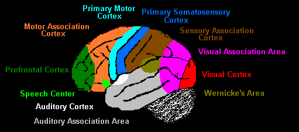
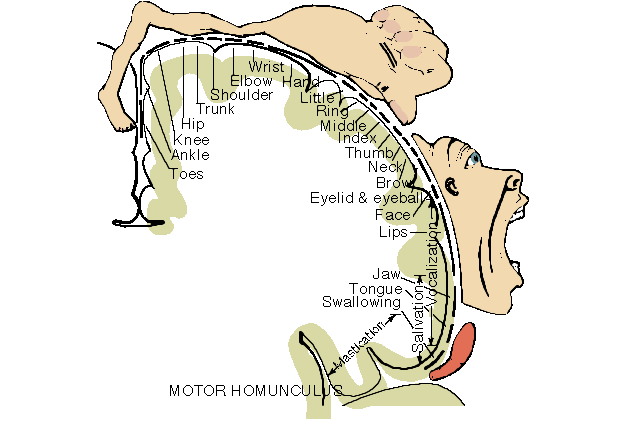
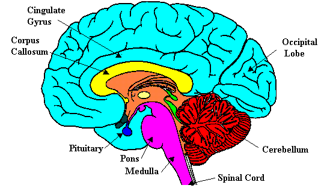

 <head> <title>(PVW) the human mind</title> <meta content="IE=9" http-equiv="X-UA-Compatible"></meta> <link href="css/page_style.css" rel="stylesheet" type="text/css"></link> </head><body>
 What is the human mind?
-----------------------

The cerebral cortex is the part of the brain that we understand to be the place of conscience thought. People have been fascinated by differences in the functions of the left and right side of the brain. However, these differences in left and right brain vary with culture, gender, right-handedness versus left-handedness, dyslexia, and various other things. The functions with respect to the front and back of the brain are much more standard. The following image from [Functional Divisions of the Cerebral Cortex](http://web.archive.org/web/19961220112432/http://weber.u.washington.edu/~chudler/funbrain.gif), a page in [Neuroscience for Kids](http://web.archive.org/web/19990117025111/http://weber.u.washington.edu/~chudler/neurok.html), shows these functions.

 The primary motor cortex from left to right across the center of the brain is where we control voluntary muscle movement. Just behind it is the primary somatosensory cortex, where touch and the senses in the skin provide the primary sensory feedback for the muscles. Note that the cerebral cortex from the primary somatosensory cortex backwards is devoted to the senses (input, acquisition of knowledge), while from the primary motor cortex forward is devoted to action and decision making functions (output, outward expression). The visual part of the cerebral cortex occupies a large amount of the input area. People have associated the eyes with knowledge. The auditory part of the cerebral cortex also occupies a large part of the input area. People also associate words with knowledge.

The primary motor cortex and primary somatosensory cortex has basically the same layout to the body. The following figure of the motor homunculus is from An Internet Ancillary to PSYCHOLOGY 4th edition by Henry Gleitman. What noticeably occupy more room disproportionately than the rest of the body are the hands and the parts associated with speech.

 

What we understand so far about the physical layout of the cerebral cortex confirms what we already know about ourselves. Sight and hearing occupy most of our sensory thoughts. We prefer the hands to any other part of the body for moving or manipulating objects. While we sense with many of the organs on the head, the mouth and tough are our primary organs for communicating. People who cannot speak usually communicate with the hands. The Hebrew language associated work with the hands. The mouth and tongue have an obvious connection with the auditory section and are close to that area. The hands, arms, trunk, legs, and feet are close to the visual area of the brain. This aids coordination of the body movements with vision. Hand-eye coordination is a very critical part of human development.

The cerebral cortex contains functions that we control. The ratio of the cerebral cortex to the brain is much larger in human beings than most animals. For the same reason, human babies are more dependent upon their parents for survival. It takes human beings three years just to finish developing the physical connections between hand-eye coordination. Experiments done on cats showed that, when their vision was blocked during the period that vision developed, they were permanently blind because the pathways failed to develop between the eyes and the brain.

The more removed areas of the brain are from the cerebral cortex the less they relate to conscious thought. The following drawing of a brain sectioned down the middle is from [Neuroscience for Kids](http://web.archive.org/web/19990117025111/http://weber.u.washington.edu/~chudler/neurok.html).

 The brain stem (Pons and Medulla in the drawing) is the most removed from the cerebral cortex. It is responsible for the most basic functions of life such as breathing, heart rate and blood pressure. The Cerebellum is responsible for the automatic functions of coordination in movement, balance, and posture. The thalamus (above the brain stem, not in the drawing) receives and relays sensory information to the cerebral cortex. Information from the cerebral cortex also to other areas of the brain and spinal cord also travels through the thalamus. The hypothalamus (above the brain stem, not in the drawing) controls the body temperature, emotions, hunger, and thirst. It controls many of the desires necessary for survival and reproduction.

Unlike computer memory, our single moments of memory are not located in a single place. Some describe memory as holographic because all the areas of the brain related to that memory (the senses, emotions, decisions, thoughts, etc.) are involved in the memory. Brain damage in a particular area does not erase memories, but only a particular function related to those memories associated with that area of the brain. We tend to have better recall of emotionally positive experiences, while we often suppress emotionally negative experiences until we are better able to cope with them. We can talk about separate areas of the mind such as the intellect, the will (volition), and the seat of emotions, but we must recognize that they all work together rather than independently.

Newer article on this subject "[How does the brain produce volition (will), cognition (intellect), and emotions (feelings)?](mindinbrain.html)"

  
- [Back to home page.](index.html)
- [Back to "Answers to Some Philosophical Questions".](philosop.html)
- [How to receive a new life in Christ.](gospel.html)

Email: [pvwebb1@hotmail.com](mailto:pvwebb1@hotmail.com)

