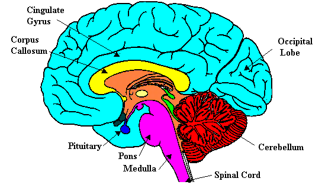

 <head> <title>(PVW) How does the brain produce volition, cognition, and emotions?</title> <meta content="IE=9" http-equiv="X-UA-Compatible"></meta> <link href="css/page_style.css" rel="stylesheet" type="text/css"></link> </head><body>
How does the brain produce volition (will), cognition (intellect), and emotions (feelings)?
-------------------------------------------------------------------------------------------

How does the brain produce volition (will), cognition (intellect), and emotions (feelings)? Why ask this question? The answer helps to define them.

Volition makes decisions, which controls actions. Cognition collects and interprets information received. The cerebral cortex contains conscious thought. The primary motor cortex and primary somatosensory cortex are two narrow cortices going from approximate one ear to the other (motor projection area) in the cerebral cortex. The primary motor cortex (next to the frontal lobe) controls voluntary muscle movement. The primary somatosensory cortex (next to the parietal lobe) interprets sensations from nerve endings in the skin. The frontal lobe contains volitional thoughts. The parietal, occipital, and temporal lobes contain cognitive thoughts.

  
 **Figure 1.** Divisions of the Cerebral Cortex   
 ([http://www.awa.com/norton/figures/fig0226.gif](http://web.archive.org/web/20060222234452/http://www.awa.com/norton/figures/fig0226.gif))

The figure below shows how the function of these two primary cortices maps to the external body parts. The right and left sides of the cortices are symmetric. The amount of area each external body part uses in the primary motor cortex tells much about humanity. The face and hands take up much more space than the rest of the body. Of the face, the mouth and tongue take up the most room. It's unclear how much a person learns versus inherits this association. Maybe comparing this map in people with physical differences would tell. Left and right brain studies show the locations of linguistic, mathematics, and other abstract thought differ with culture.
Tadanobu Tsunoda, "Hemispheric Dominance in Japan and the West," Article 6 in The Science of the Mind, by Kenneth Klivington (Cambridge, Mass.: MIT Press, 1989), pp. 54-59.

  
 **Figure 2.** The associated body layout for the primary motor cortex and primary somatosensory cortex  
 ([http://www.awa.com/norton/figures/fig0226c.gif](http://web.archive.org/web/20051231052406/http://www.awa.com/norton/figures/fig0226c.gif))
The proximity of the primary motor cortex to the primary somatosensory cortex facilitates direct feedback between movement and sensation involved in touch. Less direct feedback between the motor area and the senses is important for a child developing self-awareness. For example, when a baby moves his/her hand and sees it move, the child learns he/she caused the movement. In fact, the baby&#146;s brain depends on sensory input to develop its neural pathways. A newborn usually needs three more years to develop the neural pathways necessary for the eye-hand coordination to learn to catch a fast moving ball.

  
 **Figure 3.** Functional Divisions of the Cerebral Cortex (color of cortex area and label match)  
 ([http://faculty.washington.edu/chudler/funbrain.gif](http://web.archive.org/web/20070326011721/http://faculty.washington.edu/chudler/funbrain.gif))
The prefrontal cortex contains creative thinking, planning, and other decision making remote from muscle movement. The motor association cortex connects the prefrontal cortex (decisions distant from moving muscles) with the primary motor cortex (controlling movement). In the same fashion, the visual cortex senses farther away than touch. The visual and sensory association cortices connect vision and touch. The temporal lobes function similar with respect to hearing. The auditory association and sensory association areas connect the auditory cortex to the primary somatosensory cortex. However, the temporal lobes wrap back to the tongue and mouth areas of the primary motor and primary somatosensory cortices. This provides immediate interaction between the parts that function in language.

The hands are higher on the primary motor and primary somatosensory cortices. This associates them closer to the visual cortex. However, this association is remote compared to the auditory cortex, the speech center, and the tongue/mouth in the primary motor and primary somatosensory cortices. Without using a mirror, the eyes cannot see the body from the neck up. The area of the primary cortices below the hands controls these parts.

Apparently, internal areas of the forebrain surrounded by the cerebral cortex, such as the amygdala and hypothalamus (both not shown) contain the emotions. The hypothalamus controls the body temperature, emotions, hunger, and thirst. The amygdala controls sexual desire and fear. People can&#146;t directly control emotions and desire, but conscious thought does affect them. People can refuse to let emotions control their actions. This is how a person develops character, courage, bravery, loyalty, and faithfulness. In this context, emotion has a broader sense including hunger, thirst, and other instincts.

  
 **Figure 4.** The brain sectioned down the middle  
 ([http://faculty.washington.edu/chudler/sagittal.gif](http://web.archive.org/web/20070206010920/http://faculty.washington.edu/chudler/sagittal.gif))
This inner area of the forebrain is between the cerebral cortex and the brain stem. The brain stem (Pons and Medulla) is responsible for the most basic functions of life such as breathing, heart rate, and blood pressure. Conscious thought, whether cognitive or volitional, affects our emotions. The emotions affect out breathing, heart rate, and blood pressure, controlled in the brain stem, so that people are ready for such things as fight or flight.

Unlike computer memory, a person's memory isn&#146;t in a single location. Some describe memory in the brain as holographic. It involves all the areas of the brain involved in that memory, the senses, movement control, decisions, and emotions. Thus, while volition, cognition, and emotion are different functions, they are interwoven and interdependent.

Older article this one replaced: "[What is the human mind?"](mind.html)

©2002 Perry Vernon Webb. You may quote this page in part or the whole as long as you   
 1) do not alter the wording and   
 2) reference this Internet page as the source of the quote.
 
- [Back to home page.](noframesindex.html)
- [Back to "Answers to Some Philosophical Questions".](philosop.html)
- [How to receive a new life in Christ.](gospel.html)
 

Email: [pvwebb1@hotmail.com](mailto:pvwebb1@hotmail.com)

 