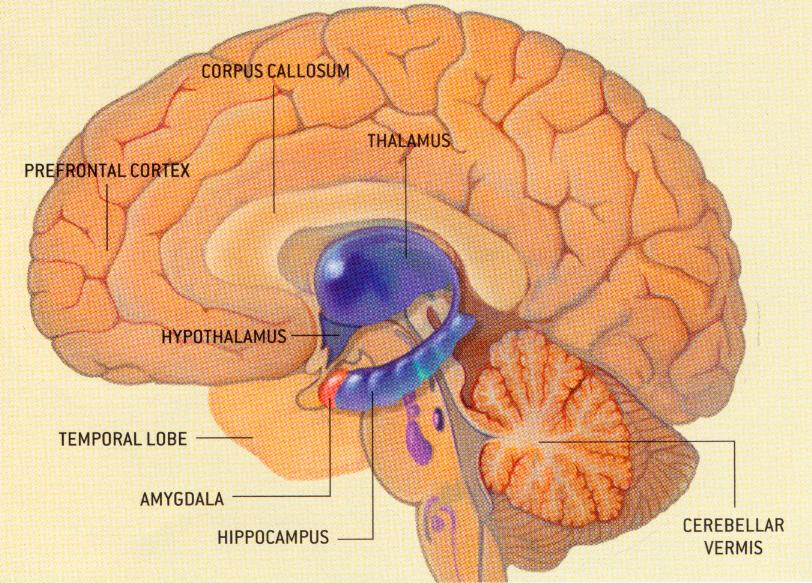

 <head> <title>(PVW) Is sexual orientation inherited or learned?</title> <meta content="IE=9" http-equiv="X-UA-Compatible"></meta> <link href="css/page_style.css" rel="stylesheet" type="text/css"></link> </head><body lang="EN-US">
Is sexual orientation inherited or learned?
-------------------------------------------

If children learn sexual orientation, then an admirable goal for parents is to teach good sexual orientation. If genes determine sexual orientation, a better goal is to teach children to accept themselves. The first view says parents are responsible to teach children sexual behavior. The second view implies parents should accept their children's sexual behavior rather than make children feel guilty, especially when it involves sexual orientation.

Is parents teaching sexual orientation that different an issue than teaching moral standards for monogamy and abstinence until marriage? Historic evidence supports that monogamy is a cultural viewpoint rather than genetically ingrained. Thus, when parents teach sexual moral standards to their children, they teach them to live by those standards rather than to follow their natural sexual desires.

The view, all that's necessary for a happy successful marriage is to find their "soul mate," implies people are born monogamous. If true, a trial period of living together to test compatibility before deciding to marry makes sense. However, if commitment, which this trial period lacks, is necessary for a successful marriage, then the expected results is that of [a study by the National Center for Health Statistics](http://web.archive.org/web/20040202084411/http://www.cdc.gov/nchs/releases/02news/div_mar_cohab.htm). This study concludes couples who live together prior to marriage are more likely to divorce.

Blaming unhappy marriages on finding the wrong person causes people to assume, if a marriage isn't working, it should end. However, that isn't the conclusion of a research team headed by Linda Waite, a University of Chicago sociologist. When this research team looked at data rather than ideology to form a conclusion, they found people unhappy with their marriage were [usually happier if they stuck with their marriage rather than divorce](http://www.americanvalues.org/html/r-unhappy_ii.html).

If monogamy is a genetic trait, people who are sexually promiscuous are different genetically and hopelessly stuck in that lifestyle. Some people turn to Christ and leave a promiscuous lifestyle to live faithfully committed to their spouse. Commitment, devotion, and moral standards must temper sexual attraction to sustain monogamy.

The root cause of sexual orientation is much deeper than whether a person is attracted to the same sex or opposite sex, it's a matter of what determines sexual attraction. Heterosexuals aren't attracted to everyone of the opposite sex. Similarly, a homosexual man wrote in a newsgroup, “I'm not attracted to all men; only the good-looking ones.”

What determines sexual attraction? Keith Kendrick, a neuroscientist at [the Babraham Institute](http://www.babraham.ac.uk/) in Cambridge, England, conducted a study, and the results strongly suggest an environmental factor for sexual attraction \[Keith M. Kendrick,... "Mothers determine sexual preferences," Nature 395, 229 - 230 (1998)\]. Dr. Kendrick noticed that men often married wives that looked much like their own mother.To test this influence he had [goats raise newborn lambs and sheep raise newborn kids](http://web.archive.org/web/20040818153823/http://more.abcnews.go.com/onair/closerlook/wnt_000211_cl_loveexperiment_feature.html). Sheep and goats raised this way wanted to mate with the species of their adopted mother rather than their own.

While it's a big step to go from sheep and goats to humans, it's more common for genes to determine behavior in animals than in humans. Fish and tadpoles swim as soon as they're bore. Many mammals walk within hours of birth. Humans take at least eight months to learn to walk. Thus, it's valid to conclude behaviors that higher mammals learn, humans also learn rather than inherit. If personal experience deceives people into thinking genetic programming determines sexual attraction, maybe personal experience also deceives homosexuals into thinking genetic programming causes same-sex attraction.

Directly addressing the genetics of same-sex attraction, one study of identical twins adopted into different families concluded that the identical twin of a homosexual is slightly more likely to be a homosexual than a person in the general population. Another twin study showed no difference. In either case one would expect a trait that genes determine to be 100% matched between identical twins, which is true with eye, skin, and hair color. Otherwise, it's only a genetic tendency rather than a deciding factor. For example, the genetic trait of being tall makes a person more likely to be a basketball player, but it doesn't make a person a basketball player.

Simon LeVay did research comparing the size of the hypothalamus on homosexual and heterosexual men \[Simon LeVay, "A Difference in Hypothalamic Structure Between Heterosexual and Homosexual Men," Science 258 (1991): 1034-1037\]. He found that the average size of the hypothalamus was smaller on homosexual men than heterosexual men. Many used LeVay's results to argue that genes determine sexual orientation. However, when Martin Teicher studied the hypothalamus on abused children \[Martin H. Teicher, "Scars That Won't Heal: The Neurobiology of Child Abuse," Scientific American, March 2002\], he discovered the average size of the hypothalamus was also smaller on abused children. In both studies, the variation of the size of the hypothalamus within the differing populations was too large to predict reliably which population a person belongs, making it difficult to apply any generalizations to the entire population.

 Since it's absurd to view the circumstances of being abused as a child as a genetic trait, Teicher and LeVay's research points to childhood circumstances rather than genetics at birth causing variations in the hypothalamus. Many homosexuals believe they were genetically programmed to be homosexual, but sexual orientation doesn't manifest itself as sexual desire until after puberty. Teicher's study confirms that environmental factors change the physical characteristics of the brain. On the other hand, physical changes to the brain have lasting effects. Homosexuality is similar to an addiction. However, rarely does a homosexual choose that lifestyle.

Some former homosexuals are now married as heterosexuals and attracted to their mates. Some even [rarely experience same-sex desires again](http://www.newdirection.ca/research/spitzer.htm). However, similar to addiction, the homosexual must strongly desire to change for it to be successful.

Evidence from studying the hypothalamus supports that people learn their sexual orientation during childhood. Implications of this go far beyond the issue of homosexuality. Children learn family roles, even incorrect one's such as child abuse, largely before puberty. This doesn't mean a person can't change. But, as Martin Teicher put it, incorrect roles can leave "scares that won't heal," even when the rest of the person does. It does mean parents have an important role of teaching their children proper sexual behavior.

The following sites discuss this subject further:

[The Gay Gene: Going, Going ... Gone](http://web.archive.org/web/20011201041816/http://www.frc.org/get/is00d2.cfm?CFID=222990&CFTOKEN=70767567), by Yvette C. Schneider

[NARTH](http://www.narth.com/)

©2002 Perry Vernon Webb. You may quote this page in part or the whole as long as you
 1) do not alter the wording and
 2) reference this Internet page as the source of the quote.
 
- [Back to home page.](index.md)
- [Back to "Answers to Some Philosophical Questions".](philosop.md)
- [How to receive a new life in Christ.](gospel.md)

Email: [pvwebb1@hotmail.com](mailto:pvwebb1@hotmail.com)

