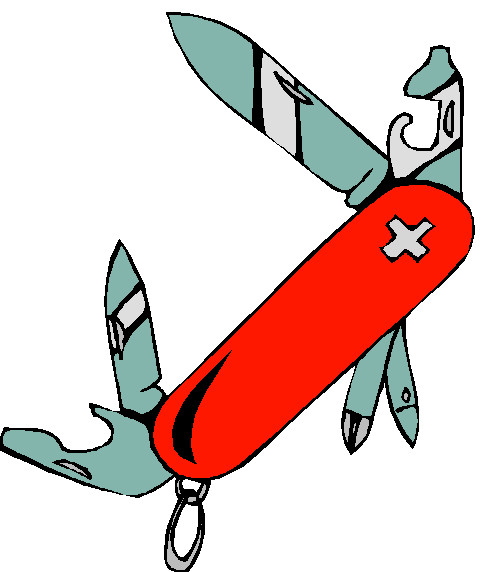

 <head> <title>(PVW) Why has violence increased in public schools?</title> <meta content="IE=9" http-equiv="X-UA-Compatible"></meta> <link href="css/page_style.css" rel="stylesheet" type="text/css"></link> </head><body>
 Why has violence increased in public schools?
---------------------------------------------

Some people blame school violence on such things as corporal punishment (spanking), [television viewing habits](http://web.archive.org/web/20040618032220/http://www.family.org/cforum/feature/a0012613.cfm), or [dissecting animals](http://web.archive.org/web/20040602205817/http://www.peta-online.org/kids/disindex.html). People advance their agenda by claiming it's the solution to the latest ill without statistical data to support such claims. In manufacturing, when a product has lower yield, an experienced engineer asks, "What changed to lower the yield?" He/she will want more than theoretical ideas explaining the downward trend in the yield. The engineer will look for data showing a correlating change in the process potentially causing the lower yield. The engineer wants to find the root cause of the yield failures rather than mere contributors. After taking corrective action, the engineer will then study the data to see if the proposed solution really worked.

School shootings didn't happen when public school administrators used corporal punishment, diametrically opposed to the claim physical punishment causes violence. Carrying [pocket knives](http://web.archive.org/web/200011171842/http://www.cfbisd.edu/pub/conduct.htm#removal) was a common practice. Administrators worried about students carving on desks rather than one another.

 While regulations on weapons at school have increased, school violence has increased rather than decreasing. How could restricting weapons contribute to school violence? Teen culture in the United States today defies authority. Unbending administrators motivate teenage rebellion. In a student survey by the Josephson Institute of Ethics, "[More than one in five (21%) high school boys and 15% of middle school males took a weapon to school at least once in the past year.](http://web.archive.org/web/20010405180219/http://www.josephsoninstitute.org/Survey2000/violence2000-pressrelease.htm)" This percentage far exceeds boys actually committing violent acts with guns. Many of these boys carry guns to school to prove they can, not to commit violence. Availability of weapons isn't the root cause of the problem. Guns were always available in the U.S.

 Violence on television, movies, and video games has a direct correlation to school violence. However, scriptwriters claim they write about the violence already in society. Violence and it's depiction feed off each other causing a thermal runaway. Normally, viewing violence causes fear and disgust rather than the desire to copy violence. Continued viewing of violence can cause a calloused and accepting attitude toward it, but that's not sufficient to motivate copying violence.

 

The trend toward selfishness and [lack of consideration for other people](http://www.arkansasonline.com/news/1999/aug/05/school-shooter-sorry-laments-wont-go-prom-pen-pal-/?print) also matches the increase in school violence. Concerning one of the two boys involved in the [Westside Middle School](http://www.arkansasonline.com/news/1998/mar/25/two-camouflage-clad-boys-arrested-schoolyard-shoot/) shooting, [his expectations of getting his own way](http://www.arkansasonline.com/news/1999/jun/06/killers-essay-haunts-westside-teacher/) contributed to his violent reaction. [Preoccupation with self](confidence.html), whether in a positive or negative manner, distracts from unselfish consideration for other people.

The devaluation in the value of human life also corresponds to the increase in school violence. Usually, people must overcome a barrier of respect for human beings to kill other people. People initially suspected revenge from shunning and ridicule to motivate the shooting at Columbine High School in Littleton, Colorado. However, the two boys' [home video](http://web.archive.org/web/20000301054129/http://www.bouldernews.com/shooting/14ccolu.html) showed [the motive to be merely the pleasure derived from committing the violence](http://www.boundless.org/2005/articles/a0000215.cfm). They had almost no barrier to overcome. They placed no value on human life, even their own.

[Teenage suicide has increased](http://web.archive.org/web/20030928092939/http://hlthed.sask.com/cni/units/10.4.2/tbsui103.html). Legal battles continue over doctor assisted suicide. [Abortion](abortion2.html) was legalized. A bioethics professor at Princeton, Dr. [Peter Singer](http://web.archive.org/web/20010206182938/http://icarus.uic.edu/~strian1/), not only advocates [killing the old and terminally ill, but also killing handicapped babies (already born)](http://www.ragged-edge-mag.com/0799/b799ps.htm) and harvesting their parts.

[
handicapped protesting Singer](http://web.archive.org/web/20010408191719/http://www.academia.org/singerquotes.html)

[
Boundless Webzine article by Anne Morse](http://www.boundless.org/2000/features/a0000185.html)

Animal dissection in schools hasn't changed during the time violence increased. Lessening the distinction between human beings and animals has. Judeo-Christian ethics expresses kindness and consideration toward animals, but places a clearly higher value on human life. Hindu ethics doesn't distinctly separate between humans and animals, but places a very high value of the life of animals as well as people. To the Hindu, to eat an animal is equivalent to cannibalism. In the effort to push conservation, [the distinction between humans and animals is diminished](http://web.archive.org/web/20041221165658/http://headlines.agapepress.org/archive/8/72001d.asp). As a result, U.S. society presents an unclear view on the value of human life to children.

Adult supervision of teenagers has an inverse correlation to school violence. The Columbine shooting investigation found a sawed off shotgun barrel on one of the boys' dressers as well as materials used to make bombs in the garage. [The parents' oversight of these items astounded investigators](http://web.archive.org/web/20020522000227/http://thedailycamera.com/shooting/26apart.html). The boys were alone while the parents worked.

 Another inverse correlation between adolescent violence and adult supervision is [Rob Slotow's](http://web.archive.org/web/200012171327/http://www.nu.ac.za/sles/staff/staff.asp?id=22629) study of [the elephant population in at Pilanesberg National Park](http://web.archive.org/web/20080930183821/http://www.und.ac.za/und/lesci/elephant/elephant_home.htm) in South Africa. The program to restore the elephant population originally used elephant calves because of better ability to relocate the smaller animals. However, when young bull elephants reached adolescence, they exhibited the strange behavior of killing white rhinos. [The solution was to introduce older bull elephants into the herd](http://web.archive.org/web/20080607013346/http://www.und.ac.za/und/lesci/elephant/clash_of_the_titans.htm).

While many factors might reduce the risk of violence in schools, the real solution is for students to value human life along with having a genuine respect and concern for each other. But, this doesn't just happen. It takes adults teaching this through example and supervision. From the example of the elephants, responsible adult men supervising teenage boys is most critical when it comes to suppressing violent behavior.

©2001 Perry Vernon Webb. You may quote this page in part or the whole as long as you
 1) do not alter the wording and
 2) reference this Internet page as the source of the quote.
 
- [Back to home page.](noframesindex.html)
- [Back to "Where I stand".](stance.html)
- [How to receive a new life in Christ.](gospel.html)

Email: [pvwebb1@hotmail.com](mailto:pvwebb1@hotmail.com)

