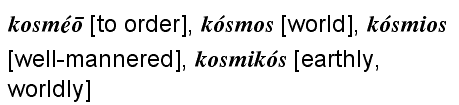

 <head> <title>(PVW) World – Kosmos in the Greek New Testament</title> <meta content="IE=9" http-equiv="X-UA-Compatible"></meta> <link href="css/page_style.css" rel="stylesheet" type="text/css"></link> </head><body>

----------------------------

World – *Kosmos* in the Greek New Testament
---------------------------------------------

This word has different meanings depending on its use. Notice the difference of "world" in [John 3:16-17](http://www.biblegateway.com/passage/?search=John+3:16-17) from [1 John 2:15-17](http://www.biblegateway.com/passage/?search=1+John+2:15-17).
"For God so loved the world that he gave his one and only Son, that whoever believes in him shall not perish but have eternal life. For God did not send his Son into the world to condemn the world, but to save the world through him." (John 3:16-17, NIV)

Do not love the world or anything in the world. If anyone loves the world, the love of the Father is not in him. For everything in the world—the cravings of sinful man, the lust of his eyes and the boasting of what he has and does—comes not from the Father but from the world. The world and its desires pass away, but the man who does the will of God lives forever. (1 John 2:15-17, NIV)

The "world" God showed His supreme love must have a different meaning than the "world" we should not love. The Greek word, *kosmos*, means something that is orderly designed.
 
 

The Septuagint, the early Greek translation of the Hebrew Old Testament, seldom uses the word, *kosmos*, with the meaning *world*. The Septuagint translators often used *kosmos* for *adornment* or *jewelry* ([Exodus 33:5](http://www.biblegateway.com/passage/?search=Exodus+33:5)). Our word *cosmetic* came from this meaning of *kosmos*. In Classical Greek it can mean *form* or *fashion*. The use of *kosmos* for world is a philosophical term for the (orderly) universe. Our word *cosmology* comes from this meaning of *kosmos*. The Septuagint uses the word *kosmos* with this meaning to translate the Hebrew word for *host* as host of heaven ([Genesis 2:1](http://www.biblegateway.com/passage/?search=Genesis+2:1)).

The Septuagint used the term *ge* () meaning *earth*, corresponding to Hebrew, *erets* (), rather than the term *kosmos* for *world*. Both terms can mean *land*, as the *land* of Egypt, or *earth*, as the globe, in contrast to the heavens. The Old Testament emphasized the promised land as an inheritance while the New Testament emphasized salvation offered to the world, meaning the people in the world. *All the people in the world* is the meaning of *world* in [John 3:16-17](http://www.biblegateway.com/passage/?search=John+3:16-17).

Paul used the term, *kosmeo* (see above) with the meaning *adorn* in [1 Timothy 2:9](http://www.biblegateway.com/passage/?search=1+Timothy+2:9) and [Titus 2:10](http://www.biblegateway.com/passage/?search=Titus+2:10). This meaning related to the external or cosmetic leads to the negative meaning for *kosmos* in [1 John 2:15-17](http://www.biblegateway.com/passage/?search=1+John+2:15-17), [Romans 12:2](http://www.biblegateway.com/passage/?search=Romans+12:2), and [James 1:27](http://www.biblegateway.com/passage/?search=James+1:27). With this use, *kosmos* means the external superficial world limited by what we can see, hear, and touch. It relates to the focus and desires on such things.

Matthew uses it for the people on the earth in [Matthew 5:14](http://www.biblegateway.com/passage/?search=Matthew+5:14), [13:38](http://www.biblegateway.com/passage/?search=Matthew+13:38). *Kosmos* has various meanings in the News Testament, sometimes simply meaning the earth or everything. However, these two meanings in [John 3:16-17](http://www.biblegateway.com/passage/?search=John+3:16-17) and [1 John 2:15-17](http://www.biblegateway.com/passage/?search=1+John+2:15-17) show almost an opposite contrast.

©2007 Perry Vernon Webb. You may quote this page in part or the whole as long as you
 1) do not alter the wording and
 2) reference this Internet page as the source of the quote.
 
- [Back to home page.](index.md)
- [Back to "The Original Languages of the Bible".](languages.md)
- [How to receive a new life in Christ.](gospel.md)

Email: [pvwebb1@hotmail.com](mailto:pvwebb1@hotmail.com)

